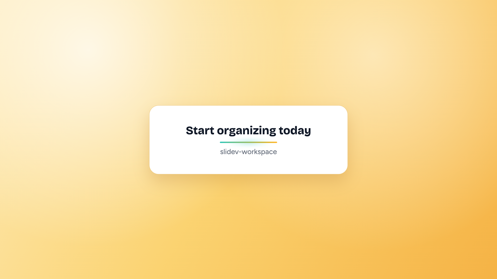

# Slidev Workspace intro video



This project introduces the [Slidev Workspace](https://github.com/leochiu-a/slidev-workspace) tool and explores Remotion skills combined with vibe coding to test the extent to which promotional videos can be produced.

In summary, for someone without any video production concepts, using Remotion skills to create a video is still quite difficult.

Because we don’t understand editing or storyboarding, we don’t know how to produce a good video. Remotion Skills only introduces how to use the library; it doesn’t teach you how to produce a high-quality video.

Currently, many articles claim that you can produce a good video with just a few prompts, but that is actually false. If you only want to produce a very short video of a few seconds, it might be possible; however, to produce a longer video (for example, this repo experimented with 30 seconds), a significant amount of time was spent adjusting details.

## Quick start

```bash
pnpm install
pnpm dev
```

## Render

```bash
pnpm exec remotion render
```